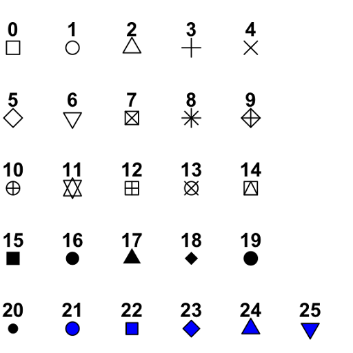

# TD4

## Objectifs
Voici les objectifs de ce chapitre :
- [ ] Créer des graphiques
- [ ] Personnaliser des graphiques
- [ ] Créer des cartes

Dans ce TD, nous utiliserons les fonctionnalités de base de R et donc **sans** le package `ggplot2`.
Ce TD utilise le fichier `velov.csv` qui décrit les statistiques des bornes vélo'v. Les données proviennent d'une API  ([plus d'info sur les données ici](https://developer.jcdecaux.com/#/opendata/vls?page=dynamic&contract=lyon)). On a supprimé certaines colonnes et ajouter le code postal. Il est conseillé de parcourir le TD en s'aidant de la correction pour comprendre les commandes R.

- `number` le numéro de la station. Attention, ce n'est pas un id, ce numéro n'est unique qu'au sein d'un contrat
- `contractName` le nom du contrat de cette station
- `name` le nom de la station
- `address` adresse indicative de la station, les données étant brutes, parfois il s'agit plus d'un commentaire que d'une adresse.
- `position` les coordonnées GPS au format WGS84
- `banking` indique la présence d'un terminal de paiement
- `bonus` indique s'il s'agit d'une station bonus 
- `status` indique l'état de la station, peut être `CLOSED` ou `OPEN`
- `connected` indique si la station est connectée au système central
- `bikes` indique le nombre de vélos disponibles sur la station
- `stands` indique le nombre de places disponibles sur la station
- `mechanicalBikes` indique le nombre de vélos mécaniques disponibles sur la station
- `electricalBikes` indique le nombre de vélos électriques disponibles sur la station
- `electricalInternalBatteryBikes` indique le nombre de vélos électriques avec batterie non amovible disponibles sur la station
- `electricalRemovableBatteryBikes` indique le nombre de vélos électriques avec batterie amovible disponibles sur la station
- `capacity` indique la capacité totale de la station
- `CodePostal` indique le code postal de la localisation de la station
- `lastUpdate` timestamp indiquant le moment de la dernière mise à jour

:warning: L'ensemble des exercices sont à réaliser dans un seul script nommé `iut_sd1_r_td4`

## Exercice 1 - Importer les données

1. Importer le jeu de données `velov.csv` à l’aide de la fonction `read.csv()`.

<details>
<summary>Correction</summary>

```r
df = read.csv(file = "velov.csv",
              header = TRUE,
              sep = ";", 
              dec = "," )
```
</details>

2. Effectuer un résumé des données. On constate que des variables sont mal typées comme `status` et `CodePostal`.

<details>
<summary>Correction</summary>

```r
summary(df)
class(df$status)
class(df$CodePostal)
```
</details>

3. Passer ces deux variables en type `factor`.

<details>
<summary>Correction</summary>

```r
df$status = as.factor(df$status)
df$CodePostal = as.factor(df$CodePostal)
```
</details>

4. On souhaite vérifier s'il y a des bornes indisponibles sur les stations. Il suffit de vérifier si le nombre de vélos et places disponibles est égal à la `capacity` de la station. Créer une colonne nommée `bornes` avec la valeur `OK`ou `KO` s'il y a un ou plusieurs bornes indisponibles sur une station. Combien y a-t-il de stations avec au moins une bornes HS ?

<details>
<summary>Correction</summary>

```r
df$bornes = ifelse(df$capacity != (df$bikes + df$stands), "KO" , "OK")
tables(df$bornes)
#en réalité, c'est aussi peut-être car la station est fermée OU que des usagers ont déposé leur vélo pile au moment de l'extraction.
```
</details>

## Exercice 2 - L'histogramme

### Mémo
| Nom de la commande | Description | Arguments Pertinents | Exemple |
|-------------------|-------------|----------------------|---------|
| `hist()` | Crée un histogramme à partir des données. | `x` : les données à utiliser <br> `main` : le titre du graphique <br> `xlab` : le label de l'axe des x <br> `col` : la couleur des barres <br> `breaks` : le nombre d'intervalles <br > `probability` : si TRUE, les hauteurs des barres représentent des densités de probabilité plutôt que des effectifs <br> `ylim` : les limites de l'axe y <br> `xlim` : les limites de l'axe x | `hist(df$stands, main = "Histogramme des stands", xlab = "Stands", col = "blue", breaks = 5, probability = FALSE, ylim = c(0, 200), xlim = c(0, 100)))` |
| `abline()` | Ajoute une ligne à un graphique existant. | `a` : l'ordonnée à l'origine <br> `b` : la pente de la ligne <br> `h` : l'emplacement de la ligne horizontale <br> `v` : l'emplacement de la ligne verticale <br> `reg` : si TRUE, trace une ligne de régression linéaire <br> `col` : la couleur de la ligne <br> `lty` : le type de ligne (par défaut, solide) | `abline(a = 0, b = 1, col = "red", lty = 2)` |
| `density()` | Estime la densité de probabilité d'un échantillon. | `x` : le vecteur de données à utiliser | `density(df$variable)` |
| `lines()` | Ajoute des lignes à un graphique existant. | `x` : les coordonnées x des points à relier <br> `lwd` : l'épaisseur de ligne <br> `lty` : le type de ligne (par défaut, solide) <br> `col` : la couleur de la ligne | `lines(x = c(1, 2, 3), lwd = 2, lty = 2, col = "blue")` |

#### Type de trait


### Exercice sur les Fonctions en R

#### La fonction `hist()`

1. Construire un histogramme de la distribution des `capacity` à l'aide de la fonction  `hist()`. N'oublier pas de mettre un titre.

<details>
<summary>Correction</summary>

```r
hist(x = df$capacity, 
     main = "Distribution de \n la capacité des stations")
```
</details>

2. Construire le même graphique mais avec 6 classes.

<details>
<summary>Correction</summary>

```r
hist(x = df$capacity, 
     main = "Distribution de \n la capacité des stations",
     breaks = 6)
```
</details>

3. Construire le même graphique mais en rouge.

<details>
<summary>Correction</summary>

```r
hist(x = df$capacity, 
     main = "Distribution de \n la capacité des stations",
     breaks = 6,
     col = "red")
```
</details>

4. Renommer l'axe des abscisses par *Capacity*. 

:warning: il faut executer à nouveau la commande pour construire le graphique

<details>
<summary>Correction</summary>

```r
hist(x = df$capacity, 
     main = "Distribution de \n la capacité des stations",
     breaks = 6,
     col = "red",
     xlab = "Capacity")
```
</details>

#### La fonction `abline()`

5. Sur le dernier graphique, ajouter une ligne horizontale bleue qui à pour ordonné la valeur `100`, à l'aide de la fonction `abline()`. La ligne s'ajoute au graphique **en cours de lecture dans la fenêtre graphique**. Vous pouvez personnaliser le trait de la ligne avec l'argument `lty`.

<details>
<summary>Correction</summary>

```r
abline(h = 100, col = "blue", lty = 2)
```
</details>

#### Les fonctions `hist()`, `lines()` et `density()`

6. Construire le même graphique mais avec la densité plutôt que les effectifs. Supprimer l'argument `break` pour rétablir les classes par défaut.

<details>
<summary>Correction</summary>

```r
hist(x = df$capacity, 
     main = "Distribution de \n la capacité des stations",
     col = "red"
     probability = TRUE,
     xlab = "Capacity")
```
</details>

7. Ajouter la courbe densité de cette distribution à l'aide des fonctions `lines()` et `density()`. On peut mettre cette courbe en bleu en changeant la taille de la courbe avec l'argument `lwd`.

<details>
<summary>Correction</summary>

```r
lines(density(df$capacity),
      lty = 2,
      col = "blue",
      lwd = 4)
```
</details>

8. Pour voir la courbe density en entier, modifier les bornes de l'axe des ordonnées de l'histogramme avec l'argument `ylim`.  Relancer l'ensemble des commandes pour tracer à nouveau le graphique.

<details>
<summary>Correction</summary>

```r
hist(x = df$capacity, 
     main = "Distribution de \n la capacité des stations",
     col = "red",
     probability = TRUE,
     xlab = "Capacity",
     ylim = c(0,0.08))

lines(density(df$capacity),
      lty = 2,
      col = "blue",
      lwd = 2)
```
</details>


## Exercice 3 - Le boxplot

Le boxplot permet aussi d'analyser les variables quantitatives avec une vue univariée ou bivariée avec une variable qualitative.
Il permet d'apporter d'autres informations telles que les quartiles et éventuelles valeurs atypiques.

### Mémo
| Nom de la commande | Description | Arguments Pertinents | Exemple |
|-------------------|-------------|----------------------|---------|
| `boxplot()` | Crée un diagramme en boîte à partir des données. | `x` : les données à utiliser <br> `main` : le titre du graphique <br> `outline` : si FALSE, supprime les points aberrants <br> `horizontal` : si TRUE, dessine un diagramme horizontal <br> `ylim` : les limites de l'axe y <br> `xlim` : les limites de l'axe x <br> `formula` : une formule décrivant les données <br> `data` : un objet de données à utiliser | `boxplot(height, main = "Diagramme en boîte de la taille", outline = FALSE, horizontal = TRUE, ylim = c(140, 200), xlim = c(0, 10))` OU `boxplot(formula = price ~ pays, data = df)` |
| `points()` | Ajoute des points à un graphique existant. | `x` : les coordonnées x des points <br> `y` : les coordonnées y des points <br> `pch` : le type de symbole à utiliser pour les points <br> `col` : la couleur des points | `points(x = c(1,5,3), y = c(-1,5,0), pch = 16, col = "blue")` |
| `par()` | Modifie les paramètres graphiques de base. | `mfrow` : spécifie le nombre de lignes et de colonnes dans la fenêtre de graphique | `par(mfrow = c(2, 2))` |
| `tapply()` | Applique une fonction à des sous-ensembles de valeurs. | `X` : le vecteur de données <br> `INDEX` : une liste ou un facteur indiquant les groupes <br> `FUN` : la fonction à appliquer <br> `...` : d'autres arguments passés à la fonction `FUN` | `tapply(X = df$variable, INDEX = df$group, FUN = mean)` |

#### Type de points


### Exercice sur les Fonctions en R

#### La fonction `boxplot()`

1. Construire une boîte à moustache de la distribution des `capacity` à l'aide de la fonction  `boxplot()`. N'oublier pas de mettre un titre.

<details>
<summary>Correction</summary>

```r
boxplot(x = df$capacity, 
        main = "Boxplot de \n la capacité des stations")
```
</details>

2. Construire le même graphique mais pivoter horizontalement.

<details>
<summary>Correction</summary>

```r
boxplot(x = df$capacity, 
        main = "Boxplot de \n la capacité des stations",
        horizontal = TRUE)
```
</details>

3. Construire le même graphique en le remettant à la verticale et en n'affichant pas les valeurs atypiques.

<details>
<summary>Correction</summary>

```r
boxplot(x = df$capacity, 
        main = "Boxplot de \n la capacité des stations",
        horizontal = FALSE,
        outline = FALSE)
```
</details>

4. Ajouter un point supplémentaire qui correspond à la moyenne de la série avec la fonction `points()`. On souhaite que ce point soit un gros carré rouge

<details>
<summary>Correction</summary>

```r
points(moy, col = "red", pch = 15, cex = 2)
```
</details>

#### La fonction `par()`

5. On souhaite comparer les vélos disponibles sur le 7ème et le 8ème arrondissement. Diviser la fenêtre graphique en deux puis constuire un boxplot pour ces deux arrondissement. Que peut-on dire ?

<details>
<summary>Correction</summary>

```r
par(mfrow=c(1,2)) #fenêtre sur 1 ligne et 2 colonnes
#7ème
df7 = subset(df, CodePostal == "69007")
boxplot(x = df7$bikes, 
        main = "Boxplot nb vélos \n 69007",
        ylim = c(0,40))
#8ème
df8 = subset(df, CodePostal == "69008")
boxplot(x = df8$bikes, 
        main = "Boxplot nb vélos \n 69008",
        ylim = c(0,40))
#C'est plus simple d'analyser les deux graphiques si la borne des ordonnées est la même.
# On remarque que la disponibilité des stations est plus homogènes sur le 8ème.
```
</details>

6. Sur le même graphique, on souhaite analyser le nombre de vélos disponibles en fonction de la variable `bonus`. Que peut-on dire ?

:warning: N'oublier pas de recadrer la fenêtre graphique sur 1x1.

<details>
<summary>Correction</summary>

```r
par(mfrow=c(1,1)) #fenêtre sur 1 ligne et 1 colonne
# Tracer le graphique boxplot
boxplot(formula = bikes ~ bonus,
        data = df, 
        main = "Dispo vélos vs Stations Bonus")
```
</details>

#### Les fonctions `points()` et `tapply()`.

7. Ajouter les moyennes de chaque groupes sur le graphique à  l'aide de la fonction `tapply()` et `points()`. 

<details>
<summary>Correction</summary>

```r
# Calculer les moyennes de chaque groupe
means <- tapply(X = df$bikes, 
                INDEX = df$bonus, 
                FUN = function(X) mean(X))
print(means)
# Ajouter les moyennes de chaque groupe au graphique
points(means, col = "red", pch = 19)
```
</details>

## Exercice 4 - Le diagramme

### Mémo
| Nom de la commande | Description | Arguments Pertinents | Exemple |
|-------------------|-------------|----------------------|---------|
| `barplot()` | Crée un diagramme à barres. | `height` : les hauteurs des barres <br> `beside` : si TRUE, les barres sont placées côte à côte <br> `main` : le titre du graphique <br> `xlab` : le label de l'axe des abscisses <br> `ylab` : le label de l'axe des ordonnées <br> `horiz` : si TRUE, les barres sont dessinées horizontalement <br> `col` : la couleur des barres <br> `las` : l'orientation des étiquettes sur l'axe des abscisses | `barplot(height = df$variable, main = "Titre du graphique", xlab = "Axe X", ylab = "Axe Y", horiz = TRUE, col = "blue", las = 2)` |
| `table()` | Crée un tableau de contingence à partir des données. | `...` : les variables à utiliser pour créer le tableau | `table(df$variable1, df$variable2)` |
| `prop.table()` | Calcule les proportions d'un tableau de contingence. | `x` : le tableau de contingence <br> `margin` : l'axe le long duquel calculer les proportions | `prop.table(x = table(df$variable1, df$variable2), margin = 1)` |
| `legend()` | Ajoute une légende à un graphique. | `x` : la position horizontale de la légende <br> `y` : la position verticale de la légende <br> `legend` : les labels de la légende <br> `fill` : les couleurs de remplissage des éléments de la légende <br> `title` : le titre de la légende | `legend(x = "topright", y = "bottomleft", legend = c("Groupe 1", "Groupe 2"), fill = c("red", "blue"), title = "Groupes")` |
| `pie()` | Crée un diagramme circulaire. | `x` : les proportions à représenter <br> `labels` : les étiquettes des sections <br> `main` : le titre du graphique <br> `col` : les couleurs des sections <br> `border` : la couleur des bordures des sections | `pie(x = c(0.2, 0.3, 0.5), labels = c("A", "B", "C"), main = "Diagramme circulaire", col = c("red", "green", "blue"))` |
| `paste()` | Concatène des vecteurs de caractères. | `...` : les vecteurs de caractères à concaténer <br> `sep` : le séparateur entre les éléments concaténés <br> `collapse` : le séparateur entre les vecteurs concaténés | `paste("Bonjour", "monde", sep = " ")` |
| `palette()` | Vecteur qui renvoie la palette de couleurs par défaut (8 couleurs). |  | `palette()` |
| `colors()` | Vecteur qui renvoie les noms des couleurs disponibles dans une palette de couleurs par défaut de R (plus de 650 couleurs). | | `colors()` |
| `dev.print()` | Exporte un graphique dans un fichier spécifié en utilisant un périphérique graphique spécifié. | `device` : le périphérique graphique à utiliser (par exemple, `png`, `pdf`, `jpeg`, etc.) <br> `file` : le nom du fichier de sortie <br> `width` : la largeur du fichier en pixels (pour PNG) ou en pouces (pour les autres formats) <br> `height` : la hauteur du fichier en pixels (pour PNG) ou en pouces (pour les autres formats) <br> `...` : autres arguments pour personnaliser le graphique | `dev.print(device = png, file = "export.png", width = 600)` |

### Exercice sur les Fonctions en R

#### Les fonctions `barplot()` et  `table()`.

1. Créer un diagramme en barre de la réparition du nombre de station `bonus` à l'aide de la fonction `barplot()`. N'oublier pas de mettre un titre.

<details>
<summary>Correction</summary>

```r
effectif = table(df$bonus)
barplot(height = effectif,
        main = "Répartition du nombre \n de station bonus")
```
</details>

2. Construire le même graphique mais pivoter horizontalement.

<details>
<summary>Correction</summary>

```r
barplot(height = effectif,
        main = "Répartition du nombre \n de station bonus",
        horiz = TRUE)
```
</details>

#### Les fonctions `barplot()` ,`prop.table()` et `legend()`.

3. Construire le même graphique mais en pourcentage.

<details>
<summary>Correction</summary>

```r
frequence = prop.table(effectif)
barplot(height = frequence,
        main = "Répartition en % du nombre \n de station bonus",
        horiz = TRUE)
```
</details>

4. Construire un diagramme bivariés avec la répartition du nombre de station bonus en fonction du nombre de station avec un terminal de paiement. Les deux variables ayant les mêmes modalités `TRUE` / `FALSE`, il est important de définir le nom de l'axe des abscisses. Que remarque t-on ?

:warning: l'ordre des variables dans la fonction `table()` influence le niveau de lecture du graphique.

<details>
<summary>Correction</summary>

```r
effectif = table(df$banking, df$bonus)
print(effectif)
barplot(height = effectif,
        main = "Bonus vs Banking",
        xlab = "Station Bonus ?")
#On remarque qu'on ne sait pas distinguer les deux modalités car il n'y a pas de légende.
```
</details>

5. Afficher une legend pour pouvoir distinguer les couleurs associées aux modalités avec *vert* pour `TRUE` et  *rouge* pour `FALSE`. On peut vérifier si le graphique est cohérent en vérifiant avec l'objet `frequence`.

<details>
<summary>Correction</summary>

```r
#Calcul des pourcentages
frequence = prop.table(x = effectif)
barplot(height = frequence,
        main = "Bonus vs Banking",
        xlab = "Station Bonus ?",
        col = c("red","green"))

#Préparer les labels
legend_labels <- colnames(frequence)
#Ajouter une légende
legend(x = "topright", 
       legend = legend_labels, 
       fill  = c("red","green"))

#Afficher les fréquences pour vérifier le graphique
print(frequence)
```
</details>

6. Même question mais en pourcentage colonne.

<details>
<summary>Correction</summary>

```r
#Calcul des pourcentages colonnes
frequence = prop.table(x = effectif, margin = 2)
barplot(height = frequence,
        main = "Bonus vs Banking",
        xlab = "Station Bonus ?",
        col = c("red","green"))

#Préparer les labels
legend_labels <- colnames(frequence)
#Ajouter une légende
legend(x = "topright", 
       legend = legend_labels, 
       fill  = c("red","green"))

#Afficher les fréquences pour vérifier le graphique
print(frequence)
```
</details>

7. Même question mais avec un diagramme bivarié non empilé à l'aide de l'argument `beside`.

<details>
<summary>Correction</summary>

```r
#Calcul des pourcentages colonnes
frequence = prop.table(x = effectif, margin = 2)
barplot(height = frequence,
        main = "Bonus vs Banking",
        xlab = "Station Bonus ?",
        col = c("red","green"),
        beside = TRUE)

#Préparer les labels
legend_labels <- colnames(frequence)
#Ajouter une légende
legend(x = "topright", 
       legend = legend_labels, 
       fill  = c("red","green"))

#Afficher les fréquences pour vérifier le graphique
print(frequence)
```
</details>

#### Les fonctions `pie()` et  `paste()`.

8. Créer un diagramme circulaire de la réparition du nombre de station `bonus` à l'aide de la fonction `pie()` en différenciant les deux catégories avec la couleur jaune et vert. N'oublier pas de mettre un titre.

<details>
<summary>Correction</summary>

```r
pie(x = effectif,
    main = "Répartition du nombre \n de station bonus",
    col = c("yellow","green"))
```
</details>

9. Construire le même graphique à l'aide de l'argument `labels` et la fonction `paste()` afin d'ajouter les etiquettes de données avec les effectifs. 

<details>
<summary>Correction</summary>

```r
etiquette = paste(rownames(effectif),"\n",effectif)
pie(x = effectif,
    main = "Répartition du nombre \n de station bonus",
    col = c("yellow","green"),
    labels = etiquette)
```
</details>

#### Les fonctions `palette()` et  `colors()`.

10. Construire dans un diagramme en barre le top 10 des codes postaux avec le plus de station velo'v. On peut pivoter les étiquettes à l'aide de l'argument `las `pour une meilleur lecture du graphique. Utiliser la fonction `palette()` comme couleur pour les barres. Que remarque t-on ?

<details>
<summary>Correction</summary>

```r
effectif = table(df$CodePostal)
top10 = sort(effectif, decreasing = TRUE)[1:10]
barplot(height = top10,
        main = "Top 10 sur le \n nombre de station",
        col = palette(),
        las = 2)  # Rotation des étiquettes à 90 degrés
#On remarque que les deux premières couleurs se répetent.
print(palette()) # la fonction `palette()` ne dispose que de 8 couleurs
```
:warning: En effet, la fonction `palette()` ne dispose que de 8 couleurs par défaut.

</details>

11. Même question mais avec la fonction `colors()`. Elle donne accès à plus de 650 couleurs. 

<details>
<summary>Correction</summary>

```r
barplot(height = top10,
        main = "Top 10 sur le \n nombre de station",
        col = colors(),
        las = 2)  # Rotation des étiquettes à 90 degrés

print(colors())
```
</details>

:warning: C'est pour cela qu'on peut utiliser les couleurs avec le nom. R les associe ensuite aux vecteurs `palette()` ou `colors()`. 

#### La fonction  `dev.print()`.

12. Exporter ce graphique dans un format .PNG à l'aide de la fonction `dev.print()`.

<details>
<summary>Correction</summary>

```r
dev.print(device = png, file = "export.png", width = 600)
```
:warning: Cette fonction exporte le graphique en cours de lecture.
</details>


## Exercice 5 - Nuage de points

### Mémo
| Nom de la commande | Description | Arguments Pertinents | Exemple |
|-------------------|-------------|----------------------|---------|
| `plot()` | Crée un nuage de points. | `x` : les valeurs de l'axe des abscisses <br> `y` : les valeurs de l'axe des ordonnées <br> `main` : le titre du graphique <br> `xlab` : le label de l'axe des abscisses <br> `ylab` : le label de l'axe des ordonnées <br> `col` : la couleur des points <br> `pch` : le type de marqueur à utiliser pour les points <br> `cex` : le facteur de mise à l'échelle pour la taille des caractères <br> `xlim` : les limites de l'axe des abscisses <br> `ylim` : les limites de l'axe des ordonnées | `plot(x = df$variable1, y = df$variable2, main = "Nuage de points", xlab = "Variable X", ylab = "Variable Y", col = "blue", pch = 16, cex = 1.5, xlim = c(0, 10), ylim = c(0, 20))` |
| `levels()` | Renvoie les niveaux d'un vecteur facteur. | `x` : le vecteur facteur dont vous souhaitez obtenir les niveaux | `levels(df$variable)` |

### Exercice sur les Fonctions en R

#### La fonction `plot()`.

1. A l'aide de la fonction `plot()`, construire un nuage de point pour étudier la corrélation entre le nombre de place disponible sur les stations et leur capacité. N'oublier pas d'ajouter un titre.

<details>
<summary>Correction</summary>

```r
plot(x = df$stands, y = df$capacity,
     main = "Place disponible vs Capacité")
```
</details>

2. Construire le même graphique en zoomant avec des abscisses et ordonnées qui vont de 0 à 60 et avec des points avec un fond noir.

<details>
<summary>Correction</summary>

```r
plot(x = df$stands, y = df$capacity,
     main = "Place disponible vs Capacité",
     xlim = c(0,60),
     ylim = c(0,60),
     pch=19)
```
</details>

#### Les fonctions `plot()` et `levels()`.

3. Construire le même graphique en affichant deux couleurs différentes selon la colonne `bornes` créé précédemment. La colonne `bornes` doit avoir le type `factor`.

<details>
<summary>Correction</summary>


```r
df$bornes = as.factor(df$bornes)
plot(x = df$stands, y = df$capacity,
     main = "Place disponible vs Capacité",
     xlim = c(0,60),
     ylim = c(0,60),
     col = df$bornes,
     pch=19)

 # Ajouter une légende
legend("topright", legend = levels(df$bornes),
       col = palette(), pch = 19)
```
</details>

4. Pour pouvoir choisir ses couleurs, il suffit d'utiliser un vecteur avec les couleurs qu'on souhaite.

<details>
<summary>Correction</summary>

```r
myColors <- c("red", "blue", "green")  
# Ajoutez plus de couleurs si nécessaire avec le code HTML des couleurs à la place des noms

# Tracer le graphique
plot(x = df$stands, y = df$capacity,
     main = "Place disponible vs Capacité",
     xlim = c(0, 60),
     ylim = c(0, 60),
     col = myColors[df$bornes],
     pch = 19)

# Ajouter une légende
legend("topright", legend = levels(df$bornes),
       col = myColors, pch = 19)
```
</details>


5. Ajouter un carré vert sur le graphique représentant la moyenne du nombre de places disponibles et la capacité des stations.

<details>
<summary>Correction</summary>

```r
moy_stands = mean(df$stands)
moy_capacity = mean(df$capacity)
points(x = moy_stands,y = moy_capacity, 
       pch = 15,
       col = myColors[3],
       cex = 2)
```
</details>

## Exercice 6 - Cartographie (spoil sur le SD2)

1. Executer le code suivant pour créer une carte à partir des colonnes `position_longitude` et `position_latitude`.

<details>
<summary>Correction</summary>

```r
# Librairies nécessaires
library(leaflet)
library(dplyr)
library(ggplot2)

# Créer une carte Leaflet
maCarte <- leaflet(df) %>% 
  addTiles() %>% 
  addMarkers(~position_longitude, 
             ~position_latitude, 
             popup = ~address)

# Afficher la carte
maCarte
```
</details>

## Liens utiles

Voici quelques liens utiles :

- [Cours sur la programmation R](https://asardell.github.io/programmation-r/)

## En bref


| Nom de la commande | Description | Arguments Pertinents | Exemple |
|-------------------|-------------|----------------------|---------|
| `main` | Le titre principal du graphique. | Chaîne de caractères | `main = "Titre du graphique"` |
| `xlab` | Le label de l'axe des abscisses. | Chaîne de caractères | `xlab = "Label X"` |
| `ylab` | Le label de l'axe des ordonnées. | Chaîne de caractères | `ylab = "Label Y"` |
| `xlim` | Les limites de l'axe des abscisses. | Vecteur de deux valeurs numériques | `xlim = c(min_value, max_value)` |
| `ylim` | Les limites de l'axe des ordonnées. | Vecteur de deux valeurs numériques | `ylim = c(min_value, max_value)` |
| `col` | La couleur des points ou des lignes. | Nom de couleur ou code hexadécimal | `col = "blue"` |
| `pch` | Le type de marqueur à utiliser pour les points. | Code entier ou caractère | `pch = 16` |
| `lwd` | La largeur de ligne pour les lignes. | Valeur numérique | `lwd = 2` |
| `lty` | Le type de ligne pour les lignes. | Code entier | `lty = 2` |
| `cex` | Le facteur de mise à l'échelle pour la taille des caractères. | Valeur numérique | `cex = 1.5` |
| `points()` | Ajoute des points à un graphique existant. | `x`, `y` : les coordonnées des points <br> `...` : autres arguments pour personnaliser les points | `points(x = data$x, y = data$y, col = "red")` |
| `lines()` | Ajoute des lignes à un graphique existant. | `x`, `y` : les coordonnées des points pour les lignes <br> `...` : autres arguments pour personnaliser les lignes | `lines(x = data$x, y = data$y, col = "blue")` |
| `abline()` | Ajoute une ligne à un graphique existant. | `a`, `b` : paramètres de la ligne <br> `h`, `v` : positions pour les lignes horizontales ou verticales <br> `...` : autres arguments pour personnaliser la ligne | `abline(a = 0, b = 1, col = "red", lty = 2)` |
| `legend()` | Ajoute une légende à un graphique. | `x`, `y` : les coordonnées de la légende <br> `legend` : les labels de la légende <br> `fill`, `col` : les couleurs des éléments de la légende <br> `title` : le titre de la légende | `legend(x = "topright", y = "bottomleft", legend = c("Groupe 1", "Groupe 2"), fill = c("red", "blue"), title = "Groupes")` |
| `barplot()` | Crée un diagramme à barres. | `height` : les hauteurs des barres <br> `names.arg` : les étiquettes des barres <br> `main` : le titre du graphique <br> `xlab` : le label de l'axe des abscisses <br> `ylab` : le label de l'axe des ordonnées <br> `col` : la couleur des barres | `barplot(height = c(1, 2, 3), names.arg = c("A", "B", "C"), main = "Diagramme à barres", xlab = "Groupes", ylab = "Fréquence", col = "blue")` |
| `pie()` | Crée un diagramme circulaire. | `x` : les proportions à représenter <br> `labels` : les étiquettes des sections <br> `main` : le titre du graphique <br> `col` : les couleurs des sections | `pie(x = c(0.2, 0.3, 0.5), labels = c("A", "B", "C"), main = "Diagramme circulaire", col = c("red", "green", "blue"))` |
| `boxplot()` | Crée une boîte à moustaches. | `formula` : la formule indiquant les variables à utiliser <br> `data` : le jeu de données <br> `main` : le titre du graphique <br> `col` : la couleur des boîtes | `boxplot(formula = y ~ group, data = df, main = "Boîte à moustaches", col = "blue")` |
| `plot()` | Crée un nuage de points ou un autre type de graphique. | `x`, `y` : les données à tracer <br> `main` : le titre du graphique <br> `xlab` : le label de l'axe des abscisses <br> `ylab` : le label de l'axe des ordonnées <br> `col` : la couleur des points ou des lignes | `plot(x = df$variable1, y = df$variable2, main = "Nuage de points", xlab = "Variable X", ylab = "Variable Y", col = "blue")` |
| `hist()` | Crée un histogramme à partir des données. | `x` : les données à utiliser <br> `main` : le titre du graphique <br> `xlab` : le label de l'axe des abscisses <br> `ylab` : le label de l'axe des ordonnées <br> `col` : la couleur des barres | `hist(x = df$variable, main = "Histogramme", xlab = "Variable", ylab = "Fréquence", col = "blue")` |
| `par()` | Modifie les paramètres graphiques de base. | `mfrow` : spécifie le nombre de lignes et de colonnes dans la fenêtre de graphique | `par(mfrow = c(2, 2))` |