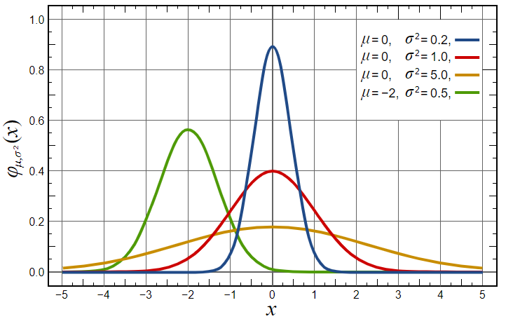
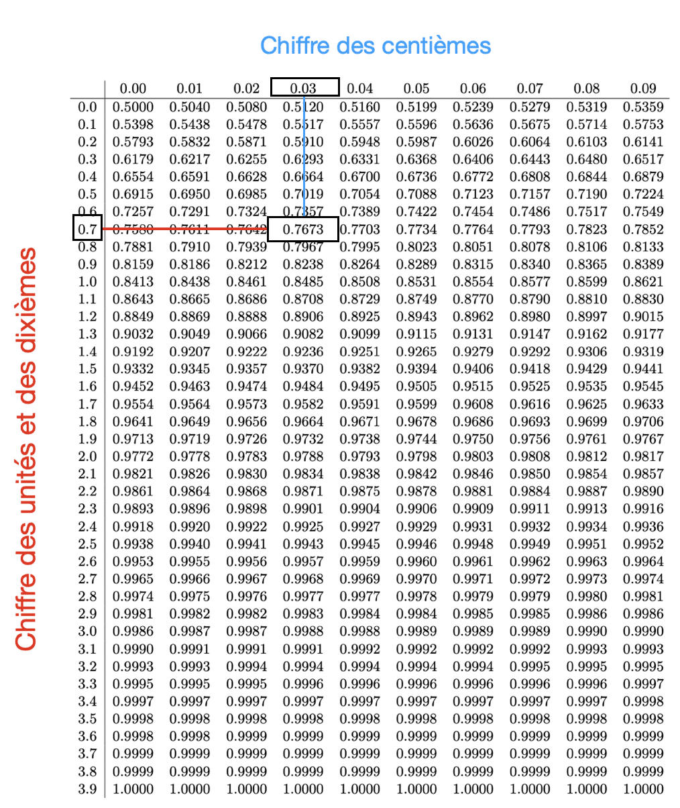

# TD5

## Objectifs
Voici les objectifs de ce chapitre :
- [ ] Lire dans la table de la loi normale avec R
- [ ] Simuler une série statistique selon une loi
- [ ] Calculer des intervalles de confiance

:warning: L'ensemble des exercices sont à réaliser dans un seul script nommé `iut_sd1_r_td5`

## Exercice 1 - Comprendre la loi normale

Dans cet exercice, nous allons effectuer plusieurs simulations de loi normale afin de comprendre ses paramètres et comment lire dans la table de la loi normale.



### Mémo
| Nom de la commande | Description | Arguments Pertinents | Exemple |
|-------------------|-------------|----------------------|---------|
| `rnorm()` | Génère des échantillons aléatoires suivant une distribution normale *N(μ,σ)* . | `n` : nombre d'échantillons à générer. `mean` : moyenne de la distribution. `sd` : écart-type de la distribution. | `echantillon_norm <- rnorm(100, mean = 10, sd = 2)` |

### La commande `rnorm()`

1. Créer une graphique vide avec comme borne d'abscisse [-5,5] et d'ordonnées [0,1].

<details>
<summary>Correction</summary>

```r
# Créer une toile de fond vide pour le graphique
par(mfrow = c(1,1))
plot(NA, xlim=c(-5, 5), ylim=c(0, 1), xlab="X", 
     ylab="Densité de probabilité", 
     main="Densités de probabilité \n de lois normales")
```
</details>

2. Programmer une boucle `for` qui à chaque itération, ajoute une courbe densité issue d'une des 4 combinaisons de paramètres de loi normale suivant : 
- *N(μ=0, σ=0.45)*
- *N(μ=0, σ=1)*
- *N(μ=0, σ=2.25)*
- *N(μ=-2, σ=0.7)*

<details>
<summary>Correction</summary>

```r
# Tracer la densité de probabilité pour chaque simulation
moyennes <- c(0, 0, 0, -2)
sigmas <- c(0.45, 1, 2.25, 0.7)
colors <- c("red", "blue", "green", "orange")
legend_labels <- c()
for (i in 1:length(moyennes)) {
  serie = rnorm(n = 1000, 
                mean = moyennes[i], 
                sd = sigmas[i])
  lines(density(serie), col = colors[i])
  legend_labels <- c(legend_labels, paste("m =", moyennes[i], ",", "s =", sigmas[i]))
}

# Ajouter une légende
legend("topright", legend=legend_labels, col=colors, lwd=2, cex=0.8)
```
</details>

3. Simuler une loi normale *N(μ=0, σ=1)* de taille 10 000.

<details>
<summary>Correction</summary>

```r
serie = rnorm(n = 1e4, mean = 0, sd = 1)
```
</details>


4. Contruire l'histograme de la distribution de la série avec sa courbe densité.

<details>
<summary>Correction</summary>

```r
hist(serie, main = "loi normal centrée-réduite",
     probability = TRUE)
lines(density(serie))
```
</details>


5. Calculer la médiane de la série.

<details>
<summary>Correction</summary>

```r
median(serie)
```
</details>

6. Calculer les quartiles de la série.

<details>
<summary>Correction</summary>

```r
quantile(serie)
```
</details>


7. Calculer les centiles de la série. Quelle valeur de la série correspond au centile *0.95* ?

<details>
<summary>Correction</summary>

```r
quantile(serie, 
         probs = seq(from = 0, 
                     to = 1, by = 0.01))

quantile(serie, 
         probs = 0.95)
# environ 1,64                  
```
</details>

8. Calculer la valeur théorique à l'aide de la fonction `qnorm()`. Vérifier cette valeur avec la fonction réciproque `pnorm()`

<details>
<summary>Correction</summary>

```r
qnorm(p = 0.95, mean = 0, sd = 1)
pnorm(q = 1.644854, mean = 0, sd = 1)
```
</details>

9. Quelle est la valeur théorique pour *P(X < x) = 0.975*.

<details>
<summary>Correction</summary>

```r
qnorm(p = 0.975, mean = 0, sd = 1)
```
</details>

10. Quelle est la probabilité théorique pour *P(X >= 1.96) = p*.

<details>
<summary>Correction</summary>

```r
1 - pnorm(q = 1.96, mean = 0, sd = 1)
```
</details>


## Exercice 2 - Construire la table de loi normale

### Mémo
| Nom de la commande | Description | Arguments Pertinents | Exemple |
|-------------------|-------------|----------------------|---------|

### Exercice sur les Fonctions en R
Dans cet exercice, nous souhaitons reproduire dans un dataframe, la table de loi normale ci-dessous : 



1. A l'aide de boucle `for`. Construire une vecteur avec les probabilités de la première colonne de la table de loi normale. On souhaite une précision avec uniquement 4 décimales.

<details>
<summary>Correction</summary>

```r
indices_lignes = seq(from = 0, to = 3.9, by = 0.1)

#on crée un vecteur vide pour ajouter les probas au fur et à mesure
all_probas = c()
#On parcourt les indices lignes
for (i in indices_lignes){
  proba = pnorm(q = i, mean = 0, sd = 1)
  #on ajoute la nouvelle proba au vecteur existant
  all_probas = c(all_probas,proba)
  all_probas = round(all_probas,digits = 4)
}
```
</details>

2. Modifier ce code pour construire la table de loi normale.

<details>
<summary>Correction</summary>

```r
indices_colones = seq(from = 0.00, to = 0.09, by = 0.01)
indices_lignes = seq(from = 0, to = 3.9, by = 0.1)

#On crée un objet résultat vide.
resultat = NULL
#On parcourt les indices colonnes
for (j in indices_colones) {
  #on crée un vecteur vide pour ajouter les probas au fur et à mesure
  all_probas = c()
  #On parcourt les indices lignes
  for (i in indices_lignes){
    quantile = i + j
    proba = pnorm(q = quantile, mean = 0, sd = 1)
    #on ajoute la nouvelle proba au vecteur existant
    all_probas = c(all_probas,proba)
    all_probas = round(all_probas,digits = 4)
  }
  #On ajoute une colonne au resultat
  resultat = cbind(resultat,all_probas)
}
```
</details>


3. Modifier le nom des lignes et colonnes.

<details>
<summary>Correction</summary>

```r
class(resultat)
table = data.frame(resultat)
colnames(table) = indices_colones
rownames(table) = indices_lignes
View(table)
```
</details>

## Exercice 3 - Simulation d'une population

### Mémo
| Nom de la commande | Description | Arguments Pertinents | Exemple |
|-------------------|-------------|----------------------|---------|

### Exercice sur les Fonctions en R

La taille moyenne des français est de 171cm avec un écart-type de 9 centimètres.

1. Produire les tailles d'une population simulée de 10.000.000 de français répartis suivant une loi normale *N(171,9). Stocker ces tailles dans un vecteur `population`.

<details>
<summary>Correction</summary>

```r
moyenne_pop<-171
sd_pop<-9
population<-rnorm(n = 1e7, 
                  mean=moyenne_pop, 
                  sd=sd_pop)

```
</details>


2. Calculer la moyenne et l'écart-type de la population. Retrouvez-vous les valeurs attendues ?

<details>
<summary>Correction</summary>

```r
mean(population)
sd(population)
```
</details>


3. Etablir l'histogramme de la taille. Retrouvez-vous la forme bien connues ?

<details>
<summary>Correction</summary>

```r
hist(population)
#on observe une courbe en cloche
```
</details>


4. Combien de personnes ont une taille inférieur à 190cm ? Combien devriez-vous en trouver théoriquement ?

<details>
<summary>Correction</summary>

```r
#observé
pop190 = population[population < 190]
length(pop190)
length(pop190) / length(population)

#en théorie
pnorm(q = 190, mean=moyenne_pop, sd=sd_pop)*1e7
```
</details>

5. Combien de personnes ont une taille supérieur à 200 cm ? Combien devriez-vous en trouver théoriquement ?.

<details>
<summary>Correction</summary>

```r
#observé
pop200 = population[population >= 200]
length(pop200)
length(pop200) / length(population)

#en théorie
#proba de P( X < 200cm)
proba_inf_200 = pnorm(q = 200, mean=moyenne_pop, sd=sd_pop)
#proba de P( X >= 200cm)
1 - proba_inf_200
```
</details>


## Exercice 4 - Simulation d'échantillon

### Mémo
| Nom de la commande | Description | Arguments Pertinents | Exemple |
|-------------------|-------------|----------------------|---------|

### Exercice sur les Fonctions en R

On va essayer d'estimer la taille moyenne de la population à partir d'un échantillon.

1. Tirez un échantillon de taille 100 dans la population initiale, à l'aide de la fonction sample. Quelle est la taille moyenne dans l'échantillon ? Quelle est l'écart-type dans l'échantillon ? Ces deux valeurs sont-elles proches de celles de la population ?

<details>
<summary>Correction</summary>

```r
taille_ech<-100
echantillon<-sample(x = population, 
                    size = taille_ech, 
                    replace = TRUE)
mean(echantillon)
sd(echantillon)
```
</details>


2. A partir de l'écart-type estimé, calculez la largeur du demi-intervalle de confiance, puis les bornes inférieures et supérieures de l'intervalle de confiance (toujours à 95\%). Pour rappel, la formule est disponible [ici](https://fr.wikipedia.org/wiki/Intervalle_de_confiance).

<details>
<summary>Correction</summary>

```r
largeur<-qnorm(p = 0.975,mean=0,sd=1)*sd_pop/sqrt(taille_ech)
borne_inf<-moyenne_pop-largeur
borne_sup <-moyenne_pop+largeur
```
</details>

3. A l'aide de la fonction `replicate()`, tirez 1000 échantillons de taille 100. Stockez dans un dataframe la moyenne et l'écart-type de chaque échantillon à l'aide de la fonction `apply()`.

<details>
<summary>Correction</summary>

```r
taille_ech<-100
nb_replicat<-1000
echantillons<-replicate(n = nb_replicat,
                        expr =  sample(population,
                                       taille_ech, 
                                       replace = TRUE))

moyennes<-apply(X = echantillons,
                MARGIN = 2,
                FUN = function(x) mean(x))
ecart_types<-apply(echantillons,
                   MARGIN = 2,
                   FUN = function(x) sd(x))
```
</details>


4. Tracer l'histogramme des moyennes des échantillons. Retrouve-t-on une forme connue ?

<details>
<summary>Correction</summary>

```r
hist(moyennes)
```
</details>

5.  Calculez la moyenne des moyennes des échantillons, ainsi que l'écart-type des moyennes des échantillons.

<details>
<summary>Correction</summary>

```r
mean(moyennes)
sd(moyennes)
```

:bulb: Normalement la moyenne des moyennes doit être (à peu près) égale à la moyenne de la population : on dit que la moyenne est un estimateur non biaisé. De même l'écart-type des moyennes des échantillons doit être (à peu près) égal à 0,9, c'est-à-dire  $\sigma/\sqrt{n}$.

</details>


6. Combien d'échantillons ont une moyenne supérieure à 172,8cm ? Quelle est le nombre théorique ?

<details>
<summary>Correction</summary>

```r
#observé
moy172 = moyennes[moyennes > 172]
length(moy172)
length(moy172) / length(moyennes)

#en théorie
#proba de P( X < 172cm)
proba_inf_172 = pnorm(q = 172, 
      mean=moyenne_pop, 
      sd=sd_pop/sqrt(taille_ech))
#proba de P( X >= 172cm)
1 - proba_inf_172
```
</details>

7. Pour chaque échantillon, calculez la largeur du demi-intervalle de confiance en utilisant l'estimation de l'écart-type calculée pour chaque échantillon, puis calculez les bornes inférieures et supérieures des intervalles de confiances (variables à rajouter dans votre dataframe)..

<details>
<summary>Correction</summary>

```r
largeur<-apply(X = echantillons,
                   MARGIN = 2,
                   FUN = function(x) pnorm(0.975)*sd(x)/taille_ech)

borne_inf_IC<-moyennes-largeur
borne_sup_IC<-moyennes+largeur
```
</details>

8. Construire un dataframe avec ces 3 vecteurs.

<details>
<summary>Correction</summary>
```r
resultat = data.frame(largeur,borne_inf_IC,borne_sup_IC)
View(resultat)
```
</details>


## Exercice 5 - L'effet de la taille de l'échantillon

### Mémo
| Nom de la commande | Description | Arguments Pertinents | Exemple |
|-------------------|-------------|----------------------|---------|

### Exercice sur les Fonctions en R

1. Créer une fonction `moyenne_echantillon()` qui prend en entrée le vecteur `V` variable d'une population et une taille `n` d'échantillon et qui donne en sortie la moyenne d'un échantillon aléatoire de taille `n` tiré dans la population tels que : `moyenne_echantillon <- function(V, n)`.

<details>
<summary>Correction</summary>

```r
moyenne_echantillon<-function(V,n) {
  return(mean(sample(x = V,size = n, replace=TRUE)))
}
```
</details>


2.  A l'aide de la fonction replicate, tirer 1000 échantillons pour chacune des tailles d'échantillons suivantes : 20, 30, 50, 100, 500, 1000 toujours à partir de la population initiale de 10.000.000 d'individus. .

<details>
<summary>Correction</summary>

```r
moyennes_20<-replicate(n = nb_replicat, 
                       expr = moyenne_echantillon(V = population,
                                                                   n = 20))
moyennes_30<-replicate(n = nb_replicat, 
                       expr = moyenne_echantillon(V = population,
                                                                   n = 30))
moyennes_50<-replicate(n = nb_replicat, 
                       expr = moyenne_echantillon(V = population,
                                                                   n = 50))
moyennes_100<-replicate(n = nb_replicat, 
                        expr = moyenne_echantillon(V = population,
                                                                    n = 100))
moyennes_500<-replicate(n = nb_replicat, 
                        expr = moyenne_echantillon(V = population,
                                                                    n = 500))
```
</details>

3. Représentez les histogrammes des moyennes pour chaque taille d'échantillon en gardant les mêmes échelles des axes des abcisses et ordonnées. Que constate-t-on (spoiler alert : cela illustre le  *théorème central limite*) ?

<details>
<summary>Correction</summary>

```r
par(mfrow=c(2,3))
hist(moyennes_20, xlim=c(161,181), main="20")
hist(moyennes_30, xlim=c(161,181), main="30")
hist(moyennes_50, xlim=c(161,181), main="50")
hist(moyennes_100, xlim=c(161,181), main="100")
hist(moyennes_500, xlim=c(161,181), main="500")
```
</details>


4. Reprendre les 3 questions précédentes  avec une nouvelle population de 10.000.000 individus tirés à partir d'une loi uniforme sur [0,1].

<details>
<summary>Correction</summary>

```r
population<-runif(n = 1e7, min = 0, max = 1)
moyennes_20<-replicate(nb_replicat, moyenne_echantillon(population,20))
moyennes_30<-replicate(nb_replicat, moyenne_echantillon(population,30))
moyennes_50<-replicate(nb_replicat, moyenne_echantillon(population,50))
moyennes_100<-replicate(nb_replicat, moyenne_echantillon(population,100))
moyennes_500<-replicate(nb_replicat, moyenne_echantillon(population,500))
par(mfrow=c(2,3))
hist(moyennes_20, xlim=c(0,1), main="20")
hist(moyennes_30, xlim=c(0,1), main="30")
hist(moyennes_50, xlim=c(0,1), main="50")
hist(moyennes_100, xlim=c(0,1), main="100")
hist(moyennes_500, xlim=c(0,1), main="500")
```

## Liens utiles

Voici quelques liens utiles :

- [Comprendre la loi normale](https://major-prepa.com/mathematiques/comment-lire-table-loi-normale-centree-reduite/)
- [Loi de probabilité avec R](https://fr.wikibooks.org/wiki/Programmer_en_R/Les_loi_de_probabilit%C3%A9s,_ajustement_et_test)
- [Les intervalles de confiances](https://fr.wikipedia.org/wiki/Intervalle_de_confiance)
- [Cours sur la programmation R - Chapitre Algorithmique](https://asardell.github.io/programmation-r/algo.html)

