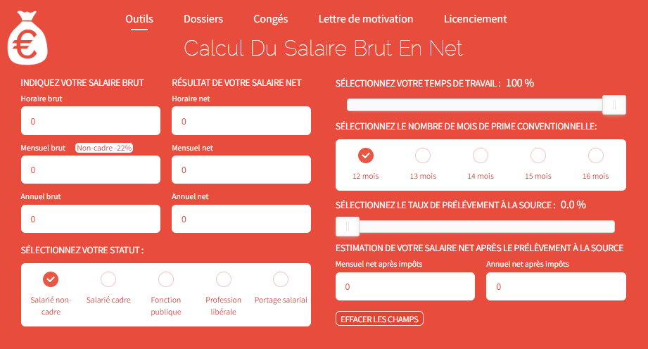

# TP4

## Objectifs
Voici les objectifs de ce chapitre :
- [ ] Construire des structures conditionnelles
- [ ] Construire des boucles
- [ ] Créer des fonctions
- [ ] Utilisation des fonctions de test logique

:warning: L'ensemble des exercices sont à réaliser dans un seul script nommé `iut_sd1_r_tp4`

## Exercice 1 - Création de fonction

Dans cet exercice, vous allez devoir programmer plusieurs fonctions pour calculer le salaire net à partir d'un salaire brut pour **le statut de salarié uniquement**. Nous utiliserons cette [page web](https://www.salaire-brut-en-net.fr/) pour comprendre les éléments qui interviennent dans le calcul. Ne pas tenir compte de l'élement *NOMBRE DE MOIS DE PRIME CONVENTIONNELLE* sur présent sur le site.



### Mémo
| Nom de la commande | Description | Arguments Pertinents | Exemple |
|-------------------|-------------|----------------------|---------|
| `is.numeric()` | Vérifie si un objet est de type numérique. | `x` : l'objet à vérifier | `is.numeric(x)` |
| `function(toto, tata = valeur_par_defaut) { ... }` | Définit une fonction avec un argument obligatoire et un argument facultatif avec une valeur par défaut. | `toto` : l'argument requis pour la fonction<br> `tata` : l'argument qui peut être omis lors de l'appel de la fonction, avec une valeur par défaut | `my_function <- function(toto, tata = 1) { ... }` |
| `return(objet_a_retourner)` | Termine l'exécution d'une fonction et renvoie une valeur spécifiée. | `objet_a_retourner` : la valeur à renvoyer à partir de la fonction | `return(resultat)` |
| `if(condition) { bloc_de_code }` | Exécute un bloc de code si la condition est vraie. | `condition` : la condition à évaluer | `if(x > 0) { print("x est positif") }` |
| `if(condition) { bloc_de_code } else { autre_bloc_de_code }` | Exécute un bloc de code si la condition est vraie, sinon exécute un autre bloc de code. | `condition` : la condition à évaluer | `if(x > 0) { print("x est positif") } else { print("x est négatif ou nul") }` |
| `if(condition1) { bloc_de_code1 } else if(condition2) { bloc_de_code2 }` | Exécute un bloc de code si la première condition est vraie, sinon vérifie une autre condition et exécute un autre bloc de code si cette condition est vraie. | `condition1`, `condition2` : les conditions à évaluer | `if(x > 0) { print("x est positif") } else if(x == 0) { print("x est nul") }` |
| `readline(prompt = "")` | Lit une ligne depuis l'entrée standard (généralement le clavier). | `prompt` : le message à afficher à l'utilisateur pour le guider lors de la saisie | `valeur <- readline(prompt = "Veuillez saisir une valeur : ")` |
| `cat(..., sep = " ")` | Concatène et imprime les éléments fournis. | `...` : les objets à imprimer <br> `sep` : le séparateur à utiliser entre les éléments (par défaut, un espace) | `cat("Hello", "world!", sep = " ")` |

### La commande `function()`

1. Créer une fonction `salaire_net_cadre()` qui prend en entrée le salaire mensuel brut d'un cadre et qui retourne le salaire net **avant impôt**. Ne pas tenir compte du temps de travail. Tester la fonction pour vérifier.

<details>
<summary>Correction</summary>

```r
salaire_net_cadre = function(salaire_brut) {
        salaire_net_avant_impot = salaire_brut * 0.75
        return(salaire_net_avant_impot) }
#Test de la fonction
salaire_net_cadre(salaire_brut = 3000)
```
</details>

2. Modifier la fonction pour que ce salaire mensuel brut **avant impôt** soit de 2500€ si l'utilisateur ne renseigne pas ce paramètre.

<details>
<summary>Correction</summary>

```r
salaire_net_cadre = function(salaire_brut = 2500) {
        salaire_net_avant_impot = salaire_brut * 0.75
        return(salaire_net_avant_impot) }
#Test de la fonction
salaire_net_cadre()
```
</details>

3. Modifier la fonction `salaire_net_cadre()` en ajoutant le paramètre temps de travail avec comme valeur par défaut 100%. Ne pas tenir compte du taux de prélèvement à la source. Tester la fonction pour vérifier.

<details>
<summary>Correction</summary>

```r
salaire_net_cadre = function(salaire_brut = 2500,temps_travail = 1) {
        salaire_net_avant_impot = salaire_brut * * 0.75 * temps_travail
        return(salaire_net_avant_impot) 
}
#Test de la fonction
salaire_net_cadre(salaire_brut = 3000,
                  temps_travail = 0.8)
```
</details>


### La commande `if() {}`

4. Modifier la fonction `salaire_net_cadre()` pour que la fonction retourne une erreur si le salaire mensuel brut en entrée n'est pas une valeur numerique. Tester la fonction pour vérifier.

<details>
<summary>Correction</summary>

```r
salaire_net_cadre = function(salaire_brut = 2500,temps_travail = 1) {
  
  if (!is.numeric(salaire_brut)) {
    return("Erreur :  le salaire brut doit être une valeur numérique")
  }
  
  salaire_net_avant_impot = salaire_brut * 0.75 * temps_travail
  return(salaire_net_avant_impot) 
}
#Test de la fonction
salaire_net_cadre(salaire_brut = "2000€")
salaire_net_cadre(salaire_brut = 2000)
```
</details>

5. Modifier la fonction `salaire_net_cadre()` pour que la fonction retourne une erreur si le temps de travail n'est pas numérique et n'est pas compris entre 0 et 1. Tester la fonction pour vérifier.

<details>
<summary>Correction</summary>

```r
salaire_net_cadre = function(salaire_brut = 2500,temps_travail = 1) {
  
  if (!is.numeric(salaire_brut)) {
    return("Erreur :  le salaire brut doit être une valeur numérique")
  }
  
  if (is.numeric(temps_travail) & (temps_travail >= 0) & (temps_travail <= 1)) {
    return("Erreur :  le temps de travail doit être une valeur numérique entre 0 et 1")
  }

  salaire_net_avant_impot = salaire_brut * 0.75 * temps_travail
  return(salaire_net_avant_impot) 
}
#Test de la fonction
salaire_net_cadre(salaire_brut = 2000, temps_travail = "100%")
salaire_net_cadre(salaire_brut = 2000, temps_travail = 0.8)
salaire_net_cadre(salaire_brut = 2000, temps_travail = 100)
```
</details>

### La commande `else() {}`

6. Créer une nouvelle fonction `salaire_net()` identique à la précédente mais avec un paramètre en plus qui est le statut *cadre/non cadre* du salarié. La fonction retourne également une erreur si le statut n'est pas *cadre* ou *non cadre*. Tester la fonction pour vérifier.

<details>
<summary>Correction</summary>

```r
salaire_net = function(salaire_brut = 2500,temps_travail = 1, statut) {
  
  if (!is.numeric(salaire_brut)) {
    return("Erreur :  le salaire brut doit être une valeur numérique")
  }
  
  if (is.numeric(temps_travail) & (temps_travail >= 0) & (temps_travail <= 1)) {
    return("Erreur :  le temps de travail doit être une valeur numérique entre 0 et 1")
  }

  if (!statut %in% c("cadre","non cadre")) {
    return("Erreur :  le statut doit être cadre ou non cadre")
  }

  if (statut == "cadre") {
        salaire_net_avant_impot = salaire_brut * temps_travail * 0.75
  } else {
        salaire_net_avant_impot = salaire_brut * temps_travail * 0.78
  }

  return(salaire_net_avant_impot) 
}
#Test de la fonction
salaire_net(salaire_brut = 2000, statut = "cadre")
salaire_net(salaire_brut = 2000, statut = "non cadre")
salaire_net(salaire_brut = 2000, statut = "technicien")
```
</details>

### La commande `else if() {}`

Voici un tableau **fictif** du taux de prélèvement à la source selon le salaire net mensuel : 

| Revenu mensuel net      | Taux |
|:------------------------:|:----:|
| Jusqu'à 1 591 €         | 0 %  |
| 1 581 € à 2 006 €       | 2,9 %|
| 2 006 € à 3 476 €       | 9,9 %|
| 3 476 € à 8 557 €       | 20 % |
| Supérieur à 8 557 €     | 43 % |

7. Modifier la fonction précédente pour calculer le salaire net mensuel **après prélèvement à la source**. Tester la fonction pour vérifier.

<details>
<summary>Correction</summary>

```r
salaire_net = function(salaire_brut = 2500,temps_travail = 1, statut) {
  
  if (!is.numeric(salaire_brut)) {
    return("Erreur :  le salaire brut doit être une valeur numérique")
  }
  
  if (is.numeric(temps_travail) & (temps_travail >= 0) & (temps_travail <= 1)) {
    return("Erreur :  le temps de travail doit être une valeur numérique entre 0 et 1")
  }

  if (!statut %in% c("cadre","non cadre")) {
    return("Erreur :  le statut doit être cadre ou non cadre")
  }

  if (statut == "cadre") {
        salaire_net_avant_impot = salaire_brut * temps_travail * 0.75
  } else {
        salaire_net_avant_impot = salaire_brut * temps_travail * 0.78
  }

  if (salaire_net_avant_impot <= 1591) {
    salaire_net_apres_impot <- salaire_net_avant_impot
  } else if (salaire_net_avant_impot <= 2006) {
    salaire_net_apres_impot <- salaire_net_avant_impot * (1 - 0.029)
  } else if (salaire_net_avant_impot <= 3476) {
    salaire_net_apres_impot <- salaire_net_avant_impot * (1 - 0.099)
  } else if (salaire_net_avant_impot <= 8557) {
    salaire_net_apres_impot <- salaire_net_avant_impot * (1 - 0.20)
  } else {
    salaire_net_apres_impot <- salaire_net_avant_impot * (1 - 0.43)
  }

  return(salaire_net_apres_impot) 
}
```
</details>

8. Créer une fonction `shifumi()` qui demande à l'utilsateur de saisir une valeur dans la console entre *pierre* , *papier* ou *ciseaux*. La fonction simule également un de ces trois choix à l'aide de la fonction `sample()` puis retourne le résultat. Tester la fonction pour vérifier.

<details>
<summary>Correction</summary>

```r
shifumi <- function() {
  # Demander à l'utilisateur de saisir une valeur
  choix_utilisateur <- readline(prompt = "Choisissez entre pierre, papier ou ciseaux : ")
  
  # Vérifier si l'utilisateur a saisi une valeur valide
  if (choix_utilisateur %in% c("pierre", "papier", "ciseaux")) {
    # Simuler un choix aléatoire pour l'ordinateur
    choix_ordi <- sample(c("pierre", "papier", "ciseaux"), 1)
    
    # Afficher les choix de l'utilisateur et de l'ordinateur
    cat("Votre choix :", choix_utilisateur, "\n")
    cat("Choix de l'ordinateur :", choix_ordi, "\n")
    
    # Retourner le résultat du jeu
    if (choix_utilisateur == choix_ordi) {
      return("Égalité !")
    } else if ((choix_utilisateur == "pierre" & choix_ordi == "ciseaux") |
               (choix_utilisateur == "papier" & choix_ordi == "pierre") |
               (choix_utilisateur == "ciseaux" & choix_ordi == "papier")) {
      return("Vous avez gagné !")
    } else {
      return("L'ordinateur a gagné !")
    }
  } else {
    return("Valeur invalide. Veuillez choisir entre pierre, papier ou ciseaux.")
  }
}

#Test de la fonction
shifumi()
```
</details>

## Exercice 2 - Création des boucles

### Mémo
| Nom de la commande | Description | Arguments Pertinents | Exemple |
|--------------------|-------------|----------------------|---------|
| `for (variable in sequence) { ... }` | Exécute un bloc de code pour chaque valeur dans une séquence spécifiée. | `variable` : la variable qui prendra les valeurs de la séquence à chaque itération | `for (i in 1:10) { ... }` |
| `while (condition) { ... }` | Exécute un bloc de code tant qu'une condition spécifiée est vraie. | `condition` : l'expression logique qui doit être vraie pour continuer à exécuter le bloc de code | `while (x < 10) { ... }` |

1. Somme cummulée : Créer une boucle `for()` qui parcourt les éléments du vecteur `c(1,2,3,4,5)` un par un. À chaque itération de la boucle, ajouter l'élément en cours au résultat précédent et afficher le résultat.

<details>
<summary>Correction</summary>

```r
resultat = 0
for (element in c(1,2,3,4,5)) {
  resultat = resultat +  element
  print(paste("le resultat est : ",resultat))
}
```
</details>

2. Somme cummulée : Créer une boucle `while()` qui calcule la somme cumulative des nombres entiers à partir de 1 jusqu'à ce que la somme dépasse 50, en affichant le résultat à chaque étape ainsi que la valeur actuelle de l'élément à laquelle la boucle s'est arrêtée. 

<details>
<summary>Correction</summary>

```r
element = 1
resultat = 0
while (resultat <= 50) {
  resultat = resultat +  element
  print(paste("le resultat est : ",resultat))
  print(paste("le programme s'est arrêté à la valeur : ", element))
  element = element + 1
}
```
</details>

3. Parcourir toutes les colonnes du dataframe `iris` à  l'aide d'une boucle `for()`. Pour chaque itération afficher la type de la colonne.

<details>
<summary>Correction</summary>

```r
for (colonne in colnames(iris)) {
        type_colonne = class(iris[ , colonne])
        print(paste("la colonne ", colonne, " est de type : ", type_colonne))
}
```
</details>

4. Même question mais avec une boucle `while()`.

<details>
<summary>Correction</summary>

```r
# Initialisation de l'indice de colonne
indice_colonne <- 1

# Tant qu'il reste des colonnes à parcourir dans iris
while (indice_colonne <= ncol(iris)) {
  # Récupération du nom de la colonne
  nom_colonne <- colnames(iris)[indice_colonne]
  
  # Récupération du type de données de la colonne
  type_colonne <- class(iris[, nom_colonne])
  
  # Affichage du résultat
  print(paste("la colonne ", nom_colonne, " est de type : ", type_colonne))
  
  # Passage à la colonne suivante
  indice_colonne <- indice_colonne + 1
}
```
</details>

## Exercice 3 - GOAT : Cas pratiques

### Mémo
| Nom de la commande | Description | Arguments Pertinents | Exemple |
|-------------------|-------------|----------------------|---------|
| `list.files(path = ".", pattern = NULL, ...) ` | Renvoie une liste de noms de fichiers dans un répertoire donné. | `path` : le chemin du répertoire à examiner (par défaut, le répertoire de travail actuel) <br> `pattern` : un motif de recherche pour filtrer les noms de fichiers (par défaut, tous les fichiers) | `fichiers <- list.files(path = "chemin/vers/repertoire", pattern = "*.txt")` |
| `file.info(...)`   | Renvoie des informations sur les fichiers spécifiés. | `...` : une liste de chemins de fichiers ou de répertoires à examiner. | `info <- file.info("chemin/vers/fichier.txt")` |
| `tolower(x)`   | Convertit les caractères en minuscules. | `x` : le vecteur ou la chaîne de caractères à convertir en minuscules. | `chaine_minuscule <- tolower("Bonjour MONDE")` |

1. Demander à l'utilisateur de saisir un nombre à l'aide de la fonction `readline()` pour afficher son carré. Faire cette opération 5 fois avec une boucle `for()`.

<details>
<summary>Correction</summary>

```r
# Boucle pour demander 5 fois un nombre à l'utilisateur
for (i in 1:5) {
  
  # Demander à l'utilisateur d'entrer un nombre
  nombre <- readline(prompt = "Entrez le nombre :")
  nombre <- as.numeric(nombre)
  
  # Calculer le carré du nombre
  carre <- nombre^2
  
  # Afficher le carré du nombre
  print(paste("Le carré de", nombre, "est", carre))
}
```
</details>


2. Construire une boucle qui parcourt les fichiers d'une dossier pour connaître leur taille en octets.

<details>
<summary>Correction</summary>

```r
# Chemin du dossier à explorer
dossier <- "chemin/vers/le/dossier"

# Liste les fichiers dans le dossier spécifié
fichiers <- list.files(dossier, full.names = TRUE)

# Affiche la taille de chaque fichier
for (fichier in fichiers) {
  info <- file.info(fichier)
  taille <- info$size
  cat("Le fichier", basename(fichier), "a une taille de", taille, "octets.\n")
}
```
</details>

3. Créer une boucle qui parcout toutes les colonnes du dataframe `iris`. Si la colonne est de type `numeric` contruire un `boxplot()` avec un titre, sinon construire un `barplot()` avec un titre.

<details>
<summary>Correction</summary>

```r
# Parcourir toutes les colonnes du dataframe iris
for (colonne in colnames(iris)) {
  # Vérifier si la colonne est de type numeric
  if (is.numeric(iris[,colonne])) {
    # Si c'est le cas, construire un boxplot avec un titre
    boxplot(iris[,colonne], main = paste("Boxplot de", colonne))
  } else {
    # Sinon, construire un barplot avec un titre
    barplot(table(iris[,colonne]), main = paste("Barplot de", colonne))
  }
}
```
</details>

4. Construire une boucle `while()` qui permet à un utilisateur de jouer au shifumi jusqu'à ce qu'il souhaite arreter.

<details>
<summary>Correction</summary>

```r
# Boucle while pour jouer au shifumi jusqu'à ce que l'utilisateur décide d'arrêter
continuer <- TRUE
while (continuer) {
  # Appeler la fonction shifumi et afficher le résultat
  resultat <- shifumi()
  cat("Résultat du jeu :", resultat, "\n")
  
  # Demander à l'utilisateur s'il souhaite continuer
  reponse <- readline(prompt = "Voulez-vous continuer à jouer ? (oui/non) : ")
  
  # Vérifier la réponse de l'utilisateur
  if (tolower(reponse) == "non") {
    print("Arrêt du jeu.")
    continuer <- FALSE  # Mettre fin à la boucle
  }
}
```
</details>

5. Le juste prix : Créer une fonction `juste_prix()` qui demande à l'utilisateur de saisir un nombre jusqu'à trouver le bon nombre généré par le programme. Le programme retourne *c'est plus* ou *c'est moins* jusqu'à ce que l'utilisateur trouve la bonne réponse. Tester votre fonction.

<details>
<summary>Correction</summary>

```r
# Fonction pour le jeu du juste prix
juste_prix <- function() {
  # Génération d'un nombre aléatoire entre 1 et 100
  nombre_a_deviner <- sample(1:100, 1)
  
  # Initialisation de la réponse de l'utilisateur
  reponse <- -1
  
  # Boucle tant que l'utilisateur n'a pas trouvé le bon nombre
  while (reponse != nombre_a_deviner) {
    # Demande à l'utilisateur de saisir un nombre
    reponse <- as.integer(readline(prompt = "Devinez le nombre : "))
    
    # Vérifie si le nombre est trop grand, trop petit ou correct
    if (reponse < nombre_a_deviner) {
      cat("C'est plus !\n")
    } else if (reponse > nombre_a_deviner) {
      cat("C'est moins !\n")
    } else {
      cat("Bravo, vous avez trouvé le juste prix !\n")
    }
  }
}

# Appel de la fonction juste_prix pour commencer le jeu
juste_prix()
```
</details>

## Liens utiles

Voici quelques liens utiles :

- [Cours sur la programmation R - Chapitre Algorithmique](https://asardell.github.io/programmation-r/algo.html)

