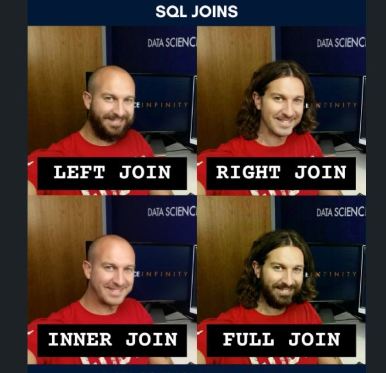

# TP5

## Objectifs
Voici les objectifs de ce chapitre :
- [ ] Construire des jointures
- [ ] Utiliser SQLite
- [ ] Interroger une base de données


:warning: L'ensemble des exercices sont à réaliser dans un seul script nommé `iut_sd1_r_tp5`

Dans ce TP, nous allons voir les jointures et des rappels de manipulation de dataframe en travaillant sur quelques jeux de données présentant des statistiques de NBA depuis sa création. Nous utiliserons les données de GitHub mais vous pouvez obtenir plus d'info sur l'ensemble des données sur [Kaggle](https://www.kaggle.com/datasets/wyattowalsh/basketball).


## Exercice 1 - Importer les données

Dans cet exercice, nous allons effectuer plusieurs simulations de loi normale afin de comprendre ses paramètres et comment lire dans la table de la loi normale.

### Mémo
| Nom de la commande | Description | Arguments Pertinents | Exemple |
|-------------------|-------------|----------------------|---------|
| `list.files()` | Liste les fichiers et/ou répertoires dans un dossier spécifié. | `path` : le chemin du dossier à lister. `pattern` : un motif de nom de fichier. `full.names` : indique si les chemins complets doivent être renvoyés. | `fichiers <- list.files(path = "chemin/vers/dossier", pattern = ".csv$", full.names = TRUE)` |
| `basename()` | Extrait le nom de fichier de chaque chemin dans un vecteur de chemins. | `path` : le chemin ou les chemins dont vous voulez extraire les noms de fichier. | `nom_fichier <- basename(fichiers[1])` |
| `file_path_sans_ext()` (package `tools`) | Extrait le nom de fichier sans extension à partir d'un chemin ou nom de fichier. | `path` : le chemin ou le nom du fichier dont vous voulez extraire le nom sans extension. | `nom_sans_ext <- file_path_sans_ext(nom_fichier)` |
| `assign()` | Affecte une valeur à un objet spécifié par un nom. | `x` : le nom de l'objet à créer ou modifier. `value` : la valeur à lui assigner. | `assign(nom_sans_ext, valeur)` |
| `Sys.time()` | Retourne l'heure système actuelle sous forme d'objet de classe `POSIXct`. | | `heure_actuelle <- Sys.time()` |

### Exercice sur les Fonctions en R

#### La commande `setwd()`

1. Placer tous les fichiers dans le même dossier nommée `nba` puis changer le répertoire courant par défaut de votre session RStudio avec la fonction `setwd()` pour pointer sur ce dossier.

:warning: Les données sont aussi disponibles sur le réseau iut à cette adresse : *L:\BUT\SD\_Données\Promo 2023\Programmation Statistique sous R\GitHub\IUT_SD1*

<details>
<summary>Correction</summary>

```r
setwd("C:/Users/Anthony/Documents/asardell/IUT_SD1/dataset/nba")
getwd()
```
</details>

:warning: Il est possible de faire exactement la même chose avec le raccourci clavier `CTRL` + `SHIFT` + `H`.

#### La commande `list.files()`

2. Lister tous les fichiers du dossier `nba`.

<details>
<summary>Correction</summary>

```r
fichiers <- list.files(path = getwd(),
                       pattern = "\\.csv$",
                       full.names = TRUE)
```
</details>

#### Les commandes `basename()` et `file_path_sans_ext()`

3. Tester la fonction `basename()` puis `file_path_sans_ext()` sur le premier fichier de la liste des fichiers afin de retrouver uniquement le nom du fichier sans l'extension `.csv`.

<details>
<summary>Correction</summary>

```r
library(tools)
print(fichiers[1])
nom_fichier = basename(path = fichiers[1])
nom_fichier_sans_extension = file_path_sans_ext(x = nom_fichier)
print(nom_fichier_sans_extension)
```
</details>

#### La commande `assign()`

4. Tester la fonction `assign()` pour importer le jeu de données avec la fonction `read.csv()`. Qu'est ce qu'on observe dans la fenêtre *Environment* ?

<details>
<summary>Correction</summary>

```r
# Lire le fichier CSV et l'affecter à une variable avec le nom du fichier
assign(x = nom_fichier_sans_extension, 
       value = read.csv(fichiers[1],
                        sep = ",",
                        dec = "."))
#un dataframe vient d'être créé avec comme nom d'objet le nom du fichier sans extension.
```
</details>

:bulb: Penser à rafraichîr la liste des objets de la fenêtre *Environment*.

### La commande `Sys.time()`

5. Utiliser ce même procéder dans une boucle `for` pour importer toutes la liste de fichiers.

:warning: c'est une opération qui prendra plusieurs secondes car il y a des fichiers volumineux.

<details>
<summary>Correction</summary>

```r
# Boucle pour lire chaque fichier CSV
for (fichier in fichiers) {
  # Extraire le nom du fichier sans extension
  nom_objet <- file_path_sans_ext(basename(fichier))
  
  # Lire le fichier CSV et l'affecter à une variable avec le nom du fichier
  start_time <- Sys.time()
  assign(nom_objet, read.csv(fichier, 
                                sep = ",",
                                dec = "."))
  end_time <- Sys.time()
  # Calcul du temps écoulé
  execution_time <- end_time - start_time
  cat("Importation : ",nom_objet, "=" , execution_time , "\n")
}
```
</details>

## Exercice 2 : Les jointures



### Mémo
| Nom de la commande | Description | Arguments Pertinents | Exemple |
|-------------------|-------------|----------------------|---------|
| `merge()` | Fusionne deux dataframes par des clés identiques ou des colonnes spécifiées. | `x` et `y` : les dataframes à fusionner. `by` : si le(s) nom(s) des colonnes à utiliser comme clé est/sont identique(s) <br> `by.x` et `by.y` : les noms des colonnes dans `x` et `y` à utiliser comme clés de fusion. <br> `all.x` et `all.y` : des indicateurs logiques spécifiant si toutes les observations de `x` ou `y` doivent être incluses dans le résultat final. | `dfJoin <- merge(dataframe1, dataframe2, by.x = "colonne_x", by.y = "colonne_y", all.x = TRUE, all.y = FALSE)` |
| `subset()` | Retourne un sous-ensemble d'un objet (par exemple, un dataframe) en fonction de certaines conditions. | `x` : l'objet à sous-ensemble, `subset` : la condition de sous-ensemble. `select` :  sélectionner un sous-ensemble de colonnes, | `sous_ensemble <- subset(dataframe, condition, select = c("colA","colB"))` |

### Exercice sur les Fonctions en R

1. Combien de match se sont dérouler à `Los Angeles` depuis la création de la NBA ?

<details>
<summary>Correction</summary>

```r
df_x = subset(team, city == "Los Angeles", select = c("id", "city"))
df_y = subset(game, select = c("game_id", "team_id_home"))
dfJoin = merge(x = df_x, y = df_y, 
               by.x = "id", 
               by.y = "team_id_home", 
               all.x = TRUE)
nrow(dfJoin)
View(dfJoin)
```
</details>

2. Quelle est l'affluence moyenne de spectacteur durant ces matchs joués à Los Angeles.

<details>
<summary>Correction</summary>

```r
df_x = dfJoin
df_y = subset(game_info, select = c("game_id", "attendance"))
dfJoin = merge(x = df_x, y = df_y, 
               by = "game_id",
               all.x = TRUE)
mean(dfJoin$attendance, na.rm = TRUE)
View(dfJoin)
```
</details>

3. Combien d'arbitres différents ont officié durant la saison 2020.

<details>
<summary>Correction</summary>

```r
df_x = subset(game_summary, season == 2020,
              select = c("game_id", "season"))
dfJoin = merge(x = df_x, y = officials, 
               by = "game_id",
               all.x = TRUE)
length(unique(dfJoin$official_id))
View(dfJoin)
```
</details>

4. Combien de matchs à officié `Dick` `Bavetta` par saison ?

<details>
<summary>Correction</summary>

```r
df_x = subset(game_summary,
              select = c("game_id", "season"))
df_y = subset(officials, first_name == "Dick" & last_name == "Bavetta")
dfJoin = merge(x = df_x, y = df_y, 
               by = "game_id",
               all.y = TRUE)
View(dfJoin)
table(dfJoin$season)
```
</details>

## Exercice 3 - GOAT : Connexion à une database SQLite

### Mémo
| Nom de la commande | Description | Arguments Pertinents | Exemple |
|-------------------|-------------|----------------------|---------|
| `dbConnect()` (package `DBI`) | Établit une connexion à une base de données en utilisant un pilote spécifique à la base de données. | `drv` : un objet de pilote de base de données. `...` : d'autres arguments spécifiques au pilote. | `mydb <- dbConnect(drv, ...) ` |
| `dbListTables()` (package `DBI`) | Liste les tables disponibles dans une base de données à laquelle vous êtes connecté. | `conn` : la connexion à la base de données. | `tables <- dbListTables(conn = mydb)` |
| `dbGetQuery()` (package `DBI`) | Exécute une requête SQL sur la base de données et récupère les résultats dans un dataframe. | `conn` : la connexion à la base de données. `statement` : la requête SQL à exécuter. | `result <- dbGetQuery(conn = mydb, statement = "SELECT * FROM ma_table WHERE condition")` |
| `dbWriteTable()` (package `DBI`) | Écrit un dataframe dans une table d'une base de données. | `conn` : la connexion à la base de données. `name` : le nom de la table à écrire. `value` : le dataframe à écrire dans la table. | `dbWriteTable(conn = mydb, "ma_table", dataframe)` |
| `dbDisconnect()` (package `DBI`) | Ferme une connexion à une base de données. | `conn` : la connexion à fermer. | `dbDisconnect(conn = mydb)` |

### Installation logiciel

1. Installer SQLite sur votre PC à l'aide de ce [tutoriel](https://www.sqlitetutorial.net/download-install-sqlite/). Il faut d'abord installer `SQLite tools` puis Install `SQLite GUI tool` dans un même dossier appelé `sqlite`.

<details>
<summary>Astuce</summary>


</details>

2. Ouvrir SQLite Studio, puis cliquer sur *Base de données* puis *Ajouter une base de données* en sélectionnant le fichier `nbaDb.sqlite` disponible sur GitHub qu'il faudra déziper. Vous avez ensuite accès à toutes vos tables dans SQLite Studio.

### Connexion avec R

Dans la suite des questions, nous allons manipuler la database avec des commandes R. Ce [tutoriel](https://cran.r-project.org/web/packages/RSQLite/vignettes/RSQLite.html) est très utile pour répondre aux questions suivantes.

1. Installer le package `DBI` et `RSQLite`. Puis créer une connexion vers votre fichier `nba.sqlite` à l'aide de la fonction `dbConnect()`.

<details>
<summary>Correction</summary>

```r
library(DBI)
library(RSQLite)
mydb <- dbConnect(SQLite(), "nbaDb.sqlite")
```
</details>

2. Lister les tables de la database SQLite à l'aide de la fonction `dbListTables()`.

<details>
<summary>Correction</summary>

```r
dbListTables(mydb)
```
</details>

3. A l'aide de la fonction `dbGetQuery()` sélectionner les 5 premières lignes de la table `team`.

<details>
<summary>Correction</summary>

```r
dbGetQuery(mydb, 'SELECT * FROM team LIMIT 5')
```
</details>

4. Refaire une des jointures de l'exercice 2 à l'aide de la fonction `dbGetQuery()`.

<details>
<summary>Correction</summary>

```r
dfJoin = dbGetQuery(mydb, '....')
```
</details>

5. Stocker la table issue de la jointure précédente dans une nouvelle table de la database SQLlite à l'aide de la fonction `dbWriteTable()`. Vérifier que la table a correctement été créée.

<details>
<summary>Correction</summary>

```r
dbWriteTable(mydb, "nom_table", dfJoin)
dbListTables(mydb)
```
</details>

6. Fermer la connexion avec la database SQLite.

<details>
<summary>Correction</summary>

```r
dbDisconnect(mydb)
```
</details>

<details>
<summary>Vous avez terminé ?</summary>


</details>

## Liens utiles

Voici quelques liens utiles :

- [Cours sur la programmation R - Chapitre Algorithmique](https://asardell.github.io/programmation-r/algo.html)
- [Installer SQLite](https://www.sqlitetutorial.net/download-install-sqlite/)
- [R et SQLlite](https://cran.r-project.org/web/packages/RSQLite/vignettes/RSQLite.html)
